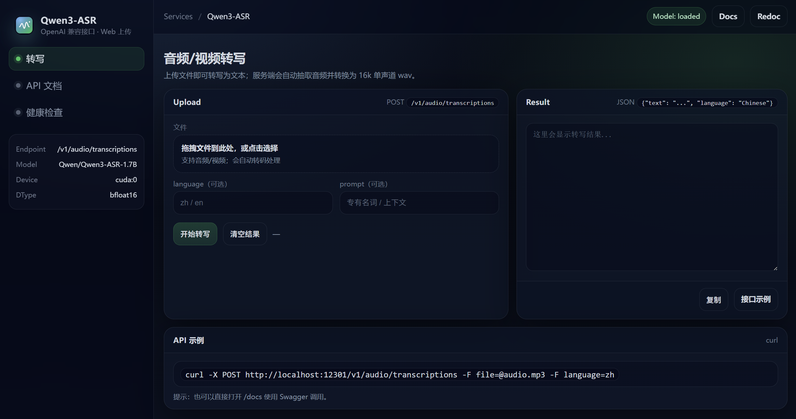

# Qwen3-ASR：自托管 ASR 推理服务（OpenAI 兼容 + Web UI + `/docs`）



把 Qwen3-ASR 封装成一个可自托管的推理服务：对外提供 OpenAI 兼容的转写接口，内置上传转写页面，并附带 FastAPI 的交互式接口文档，方便在内网/私有环境里快速接入与运维。

## 功能
- OpenAI 兼容转写接口：`POST /v1/audio/transcriptions`（可直接复用现有 OpenAI SDK/调用逻辑）
- 内置 Web UI：`GET /`（上传音频/视频即可转写）
- 交互式接口文档：`GET /docs`（Swagger UI）与 `GET /redoc`
- 模型自动下载与缓存：将 `./models` 挂载到容器 `/models`（HuggingFace 缓存目录）
- 音频/视频输入：用 ffmpeg 抽取音轨并转换为 16k 单声道 wav
- 运维友好：健康检查 `GET /health`；可选热重载 `POST /admin/reload`（`ADMIN_TOKEN` 保护）
- 文本后处理：中文数值归一化（可开关），更适合直接生成可读稿件

## 快速开始
```bash
docker compose up -d --build
```

说明：容器启动时会自动下载并加载模型（首次启动可能需要较长时间）；模型就绪后才会开始对外提供 HTTP 服务。建议使用 GPU；如需 CPU 推理，将 `DTYPE` 改为 `float32` 并确保 `DEVICE_MAP` 配置合理（性能会显著下降）。

如果机器需要走代理才能访问 HuggingFace，可在同目录创建 `.env`（或启动前导出环境变量）：
```bash
HTTP_PROXY=http://127.0.0.1:7890
# 可选：不走代理的地址（默认：localhost,127.0.0.1）
# NO_PROXY=localhost,127.0.0.1
```

打开：
- Web UI：http://localhost:12301/
- 接口文档（Swagger）：http://localhost:12301/docs
- 接口文档（ReDoc）：http://localhost:12301/redoc
- 健康检查：http://localhost:12301/health

## 接口一览
- `POST /v1/audio/transcriptions`
  - 表单字段：`file`（必填）、`language`（可选，`zh/en` 等）、`prompt`（可选，上下文/专有名词）、`temperature`（可选）
- `GET /docs` / `GET /redoc`：交互式接口文档（也可用于查看 `curl` 示例与 OpenAPI schema）
- `GET /openapi.json`：OpenAPI 规范 JSON
- `GET /health`：健康检查与运行参数（切片、后处理开关等）
- `POST /admin/reload`：热重载模型（需 `x-admin-token`）

## 切换模型（需重启）
在 `docker-compose.yml` 中修改 `MODEL_ID`，然后：
```bash
docker compose up -d
```

## 模型热重载（无需重启）
```bash
curl -X POST http://localhost:12301/admin/reload \
  -H "Content-Type: application/json" \
  -H "x-admin-token: change-me" \
  -d '{"model_id":"Qwen/Qwen3-ASR-0.6B"}'
```

## 多 GPU 说明
- `deploy.resources.reservations.devices.count` 控制容器内可见的 GPU 数量。
- `DEVICE_MAP` 控制模型放到哪一张（或哪几张）可见的 GPU 上：
  - `cuda:0` -> 使用容器内第 1 张可见 GPU
  - `cuda:1` -> 使用容器内第 2 张可见 GPU
  - `auto` -> 交给底层 HF accelerate 决定（可能会根据模型/权重在可见 GPU 间切分）

如果宿主机有两张 GPU，但你只想用第 2 张，可以设置 `count: 1`，并在环境变量里设置：
- `NVIDIA_VISIBLE_DEVICES: "1"`，同时保持 `DEVICE_MAP=cuda:0`（因为容器里只“看到”那一张 GPU）。

## 长音频与文本后处理（可选）
在 `docker-compose.yml` 的 `environment` 里可调：
- `CHUNK_SECONDS` / `CHUNK_OVERLAP_SECONDS`：长音频会先切片再转写；如果你感觉段落衔接不顺，可适当增加 `CHUNK_OVERLAP_SECONDS`。
- `CONTEXT_TAIL_CHARS`：每段转写时追加上一段尾部的上下文（字符数），用于提升跨段连续性；设为 `0` 可关闭。
- `NORMALIZE_ZH_NUMBERS`：中文数值归一化（例如 `二零二六年 -> 2026年`、`百分之五点五 -> 5.5%`）。
