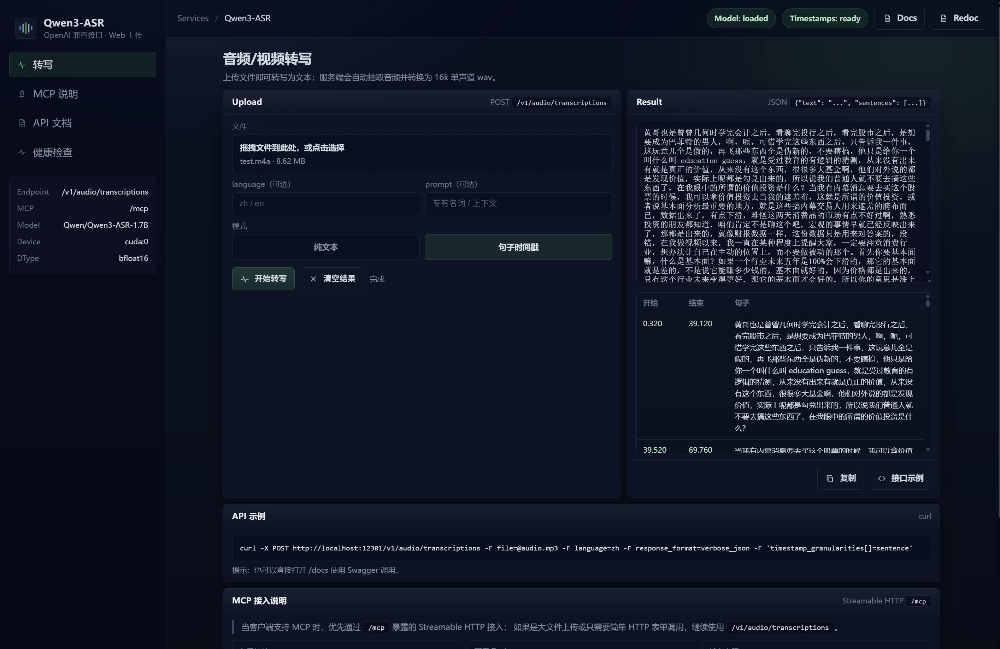

# Qwen3-ASR：自托管 ASR 推理服务

把 Qwen3-ASR 封装成一个可自托管的推理服务：对外提供 OpenAI 兼容的转写接口、HTTP MCP Server、内置上传转写页面，并附带 FastAPI 的交互式接口文档，方便在内网/私有环境里快速接入与运维。

项目地址：
- 代码仓库：[`https://github.com/Scisaga/qwen3-asr-openai`](https://github.com/Scisaga/qwen3-asr-openai)
- 镜像仓库（GHCR）：`ghcr.io/scisaga/qwen3-asr-openai:latest`

## 功能
- OpenAI 兼容转写接口：`POST /v1/audio/transcriptions`（可直接复用现有 OpenAI SDK/调用逻辑）
- MCP Server：HTTP 挂载到 `POST/GET /mcp`（Streamable HTTP）
- 内置 Web UI：`GET /`（上传音频/视频即可转写）
- 交互式接口文档：`GET /docs`（Swagger UI）与 `GET /redoc`
- 模型自动下载与缓存：将 `./models` 挂载到容器 `/models`（HuggingFace 缓存目录）
- 音频/视频输入：用 ffmpeg 抽取音轨并转换为 16k 单声道 wav
- 运维友好：健康检查 `GET /health`；可选热重载 `POST /admin/reload`（`ADMIN_TOKEN` 保护）
- 文本后处理：中文数值归一化（可开关），更适合直接生成可读稿件
- 句子级时间戳：可选返回每个句子的 `start` / `end` 秒级区间



## 快速开始
```bash
docker compose up -d --build
```

如果机器需要走代理才能访问 HuggingFace，可在同目录创建 `.env`（或启动前导出环境变量）：
```bash
HTTP_PROXY=http://127.0.0.1:7890
# 可选：不走代理的地址（默认：localhost,127.0.0.1）
# NO_PROXY=localhost,127.0.0.1

# 可选：构建阶段 pip 源（网络不稳时建议设置）
# PIP_INDEX_URL=https://pypi.tuna.tsinghua.edu.cn/simple
```

打开：
- Web UI：http://localhost:12301/
- MCP HTTP：http://localhost:12301/mcp
- 接口文档（Swagger）：http://localhost:12301/docs
- 接口文档（ReDoc）：http://localhost:12301/redoc
- 健康检查：http://localhost:12301/health

## MCP 快速开始

### HTTP MCP
服务启动后，MCP Streamable HTTP 入口固定为：

```text
http://localhost:12301/mcp
```

适合远端客户端或通过网关统一接入的场景。

## MCP 能力一览

### Tool
- `transcribe_audio`
  - 入参：`audio_base64`（必填）、`filename`（可选）、`mime_type`（可选）、`language`（可选）、`prompt`（可选）、`response_format`（可选）、`timestamp_granularities`（可选）
  - 返回：`{"text": "...", "language": "Chinese"}`
  - 句子时间戳：传 `response_format="verbose_json"` 与 `timestamp_granularities=["sentence"]`，返回 `{"text": "...", "language": "Chinese", "duration": 12.34, "sentences": [{"id": 0, "text": "...", "start": 0.0, "end": 1.2}]}`

### Resources
- `qwen3asr://health`：当前模型、device、dtype、并发、切片与 forced aligner 状态
- `qwen3asr://usage`：MCP 工具参数说明、返回格式、大小限制与推荐用法

### Prompts
- `transcribe_audio_workflow`：指导客户端何时以及如何调用 `transcribe_audio`
- `transcript_cleanup_workflow`：指导客户端在转写后进行分段、整理、摘要时保持事实不变

## MCP 输入限制

- MCP 首版只支持 `audio_base64`，不支持 `multipart/form-data`、`audio_url`、本地路径或 `file://` URI。
- `audio_base64` 支持直接传 base64 字符串，也支持 `data:*;base64,...` 形式。
- 默认大小限制由 `MCP_MAX_INPUT_BYTES` 控制，默认值为 `33554432`（32 MiB，按解码后的原始字节数计算）。
- 由于 base64 不适合长音频/大视频，较大文件建议继续使用 `POST /v1/audio/transcriptions` 上传。

## 资源需求

- **模型加载显存**：`Qwen/Qwen3-ASR-1.7B` + `DTYPE=bfloat16`（单卡）加载后显存占用约 **5.086 GiB**（示例值；不同驱动/框架版本会有波动）。
- **句子时间戳显存**：默认还会加载 `Qwen/Qwen3-ForcedAligner-0.6B`，会额外增加启动时间与常驻显存占用；显存紧张时可将 `FORCED_ALIGNER_MODEL_ID` 设为空字符串关闭。
- **推理时额外占用**：转写过程中会在模型常驻显存之外额外分配工作区/缓存；长音频、较大的 `MAX_NEW_TOKENS` 或更高并发会明显抬升峰值显存。
- **如何查看**：在宿主机执行 `nvidia-smi`（或 `nvidia-smi -l 1` 观察峰值）；也可以先启动服务，等模型加载完成后再看“常驻占用”。

## Docker 部署示例
```bash
docker run -d --name qwen3_asr_openai \
  --gpus all \
  -p 12301:12301 \
  -e MODEL_ID="Qwen/Qwen3-ASR-1.7B" \
  -e DEVICE_MAP="cuda:0" \
  -e DTYPE="bfloat16" \
  -e FORCED_ALIGNER_MODEL_ID="Qwen/Qwen3-ForcedAligner-0.6B" \
  -e HF_HOME="/models" \
  -v ./models:/models \
  ghcr.io/scisaga/qwen3-asr-openai:latest
```

## 接口一览
- `POST /v1/audio/transcriptions`
  - 表单字段：`file`（必填）、`language`（可选，`zh/en` 等）、`prompt`（可选，上下文/专有名词）、`response_format`（可选，`json` / `verbose_json`）、`timestamp_granularities[]`（可选，`sentence`）、`temperature`（可选）
- `POST /mcp` / `GET /mcp`：MCP Streamable HTTP 入口
- `GET /docs` / `GET /redoc`：交互式接口文档（也可用于查看 `curl` 示例与 OpenAPI schema）
- `GET /openapi.json`：OpenAPI 规范 JSON
- `GET /health`：健康检查与运行参数（切片、后处理开关等）
- `POST /admin/reload`：热重载模型（需 `x-admin-token`）

句子级时间戳示例：
```bash
curl -X POST http://localhost:12301/v1/audio/transcriptions \
  -F file=@audio.mp3 \
  -F language=zh \
  -F response_format=verbose_json \
  -F 'timestamp_granularities[]=sentence'
```

返回示例：
```json
{
  "text": "第一句话。第二句话。",
  "language": "Chinese",
  "duration": 3.42,
  "sentences": [
    {"id": 0, "text": "第一句话。", "start": 0.0, "end": 1.24},
    {"id": 1, "text": "第二句话。", "start": 1.25, "end": 3.12}
  ]
}
```

## 默认提示词
服务内置了财经/投资类 ASR 默认提示词，用于提升口播里专有名词、英文缩写和行业词的识别稳定性。该功能不改变接口字段，仍然使用 OpenAI 兼容的 `prompt` 参数。

- 默认词表维护在 `prompts/finance_terms.txt`，一行一个词或短语；空行和 `#` 注释会被忽略，重复词会自动去重。
- 未传 `prompt` 时，服务会自动使用默认财经提示词。
- 传入 `prompt` 时，最终上下文会按“用户 prompt 在前、默认财经词表在后”的顺序合并，方便调用方临时补充当前音频的人名、公司名、产品名或会议上下文。
- Docker 镜像默认把词表放在 `/app/prompts/finance_terms.txt`；如需使用自定义词表，可通过 `DEFAULT_FINANCE_PROMPT_PATH` 指向新的文件路径，并把该文件挂载进容器。
- 词表示例包括 `price in`、`DCF`、`无风险收益率`、`贴现率`、`现金流`、`财务洗澡`、`困境反转`、`去库存`、`去产能`、`基本面`、`估值`、`PE`、`财报`、`国企`、`民企`、`市值管理`、`高端消费`、`价格战` 等。

自定义词表示例：
```yaml
services:
  qwen3_asr:
    environment:
      DEFAULT_FINANCE_PROMPT_PATH: "/app/prompts/custom_terms.txt"
    volumes:
      - ./models:/models
      - ./prompts/custom_terms.txt:/app/prompts/custom_terms.txt:ro
```

## 切换模型（需重启）
在 `docker-compose.yml` 中修改 `MODEL_ID`，然后：
```bash
docker compose up -d
```

## 模型热重载（无需重启）
```bash
curl -X POST http://localhost:12301/admin/reload \
  -H "Content-Type: application/json" \
  -H "x-admin-token: change-me" \
  -d '{"model_id":"Qwen/Qwen3-ASR-0.6B"}'
```

## 多 GPU 说明
- `deploy.resources.reservations.devices.device_ids` 控制容器内可见的 GPU。只用第 1 张卡写 `["0"]`；同时使用第 1、2 张卡写 `["0","1"]`。
- 默认 `AUTO_BACKEND_REPLICAS=1`：当容器可见多张 GPU 时，外层服务会按“每张卡 1 个 ASR worker”启动多个后端，并对 `/v1/audio/transcriptions` 与 MCP 转写请求做轮询分发，从而支持多请求并发转写。
- 每个 worker 会被限制到单张 GPU；如果 `DEVICE_MAP` 是 `cuda:*`，worker 内会自动改为 `cuda:0`，因为该 worker 只看得到自己的那张卡。
- `MAX_CONCURRENT_TRANSCRIBE` 控制单个 worker 内部并发，默认 `1`。多卡并发通常靠增加 worker 数量，而不是提高单 worker 并发。
- 如果只想保留旧的单进程行为，可设置 `AUTO_BACKEND_REPLICAS=0`。
- `BACKEND_PORT` 是 worker 起始端口，默认 `8001`；多卡时依次使用 `8001`、`8002`、...

单进程模式下，`DEVICE_MAP` 控制模型放到哪一张（或哪几张）可见的 GPU 上：
  - `cuda:0` -> 使用容器内第 1 张可见 GPU
  - `cuda:1` -> 使用容器内第 2 张可见 GPU
  - `auto` -> 交给底层 HF accelerate 决定（可能会根据模型/权重在可见 GPU 间切分）

如果宿主机有两张 GPU，但你只想用第 2 张，在 `docker-compose.yml` 里设置：
```yaml
device_ids: ["1"]
```

## 长音频与文本后处理（可选）
在 `docker-compose.yml` 的 `environment` 里可调：
- `CHUNK_SECONDS` / `CHUNK_OVERLAP_SECONDS`：长音频会先切片再转写；财经/投资类口播建议 `CHUNK_SECONDS=180`、`CHUNK_OVERLAP_SECONDS=3`。
- `CONTEXT_TAIL_CHARS`：每段转写时追加上一段尾部的上下文（字符数），用于提升跨段连续性；设为 `0` 可关闭。
- `MAX_NEW_TOKENS`：单段最大输出长度；长口播建议至少 `2048`，避免单段还没转完就被截断。
- `FORCED_ALIGNER_MODEL_ID`：句子级时间戳使用的 forced aligner，默认 `Qwen/Qwen3-ForcedAligner-0.6B`；设为空字符串可关闭时间戳模式。
- `FORCED_ALIGNER_DEVICE_MAP` / `FORCED_ALIGNER_DTYPE`：forced aligner 的设备与精度，默认跟随 `DEVICE_MAP` / `DTYPE`。
- 默认财经 prompt：服务会在未传 `prompt` 时自动使用财经/投资术语词表；传入 `prompt` 时，会把用户 prompt 放在前面并合并默认词表。详细规则见“默认提示词”章节。
- `NORMALIZE_ZH_NUMBERS`：中文数值归一化（例如 `二零二六年 -> 2026年`、`百分之五点五 -> 5.5%`），但会保留 `三五年`、`两三个月` 这类口语近似数字。
- `MCP_MAX_INPUT_BYTES`：MCP `audio_base64` 的解码后字节上限；大文件建议改走 HTTP 上传接口。

测试或重建带时间戳模式的容器前，先用 `docker compose stop qwen3_asr` 释放 ASR 容器占用的 GPU；不要用 `docker pause`，因为暂停进程通常不会释放显存。随后用 `nvidia-smi` 确认显存释放，再执行构建或运行验证。

## License
MIT License（见 `LICENSE`）。
